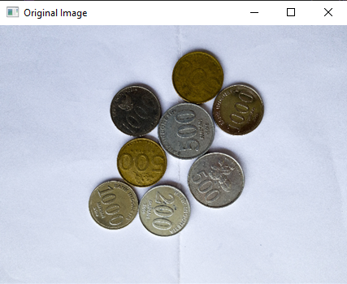
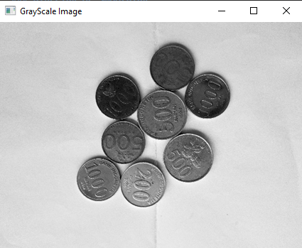
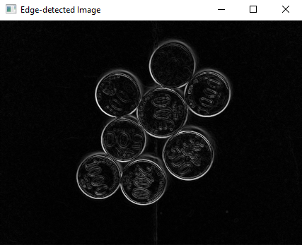
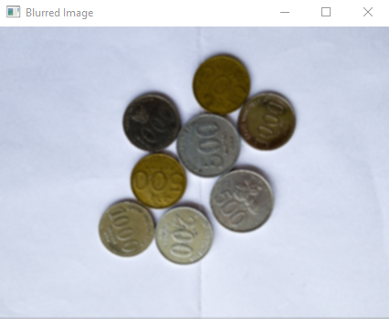
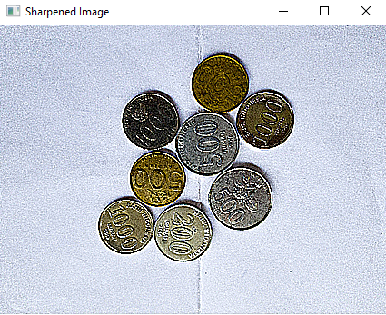
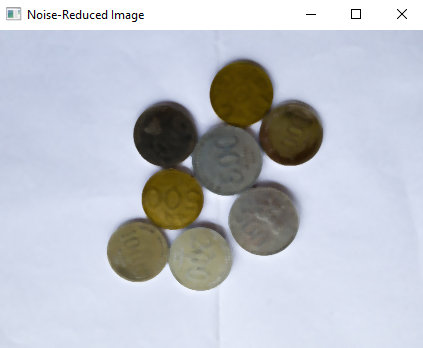

## Convolution Example
<hr>
In this section, 
we'll explore a basic convolution process using Python and OpenCV. Convolution is a fundamental operation in image processing, allowing us to apply various filters and transformations to images. Thanks to libraries like OpenCV, we have access to a wide range of built-in features for convolution tasks, making it easier to perform complex operations with just a few lines of code.


### Edge Detection:

- Convolution can be used for edge detection in images. A common filter for edge detection is the Sobel filter.

- The convolution operation with the Sobel filter highlights edges in the image by detecting sudden changes in pixel intensity.


```python
import cv2
import numpy as np

# Load the image
image = cv2.imread('input_image.jpg', cv2.IMREAD_GRAYSCALE)

# Apply Sobel filter for edge detection
sobel_x = cv2.Sobel(image, cv2.CV_64F, 1, 0, ksize=3)
sobel_y = cv2.Sobel(image, cv2.CV_64F, 0, 1, ksize=3)
sobel_combined = cv2.magnitude(sobel_x, sobel_y)

# Display the original and edge-detected images
cv2.imshow('Original Image', image)
cv2.imshow('Edge-detected Image', sobel_combined)
cv2.waitKey(0)
cv2.destroyAllWindows()
```
<br>



<br>



<br>



<hr>

### Blurring or Smoothing:

- Convolution with a Gaussian filter can be used to blur or smooth images.

- The Gaussian filter applies a weighted average to neighboring pixels, resulting in a blurring effect that removes high-frequency details.

<br>

```python
import cv2

# Load an image
image = cv2.imread('input_image.jpg')

# Apply Gaussian blur
blurred_image = cv2.GaussianBlur(image, (5, 5), 0)

# Display original and blurred images
cv2.imshow('Original Image', image)
cv2.imshow('Blurred Image', blurred_image)
cv2.waitKey(0)
cv2.destroyAllWindows()
```

<br>


<br>



<br>
<hr>

### Sharpening:

- Convolution with a sharpening filter enhances edges and details in images.

- The sharpening filter emphasizes the difference between neighboring pixels, making edges appear sharper.

<br>

```python

import cv2
import numpy as np

# Load an image
image = cv2.imread('input_image.jpg')

# Define the sharpening kernel
kernel = np.array([[-1, -1, -1],
                   [-1,  9, -1],
                   [-1, -1, -1]])

# Apply the sharpening kernel using filter2D
sharpened_image = cv2.filter2D(image, -1, kernel)

# Display original and sharpened images
cv2.imshow('Original Image', image)
cv2.imshow('Sharpened Image', sharpened_image)
cv2.waitKey(0)
cv2.destroyAllWindows()

```

<br>


<br>



<br>
<hr>

### Noise Reduction:

- Convolution with a noise reduction filter, such as a median filter, helps reduce noise in images.
- The median filter replaces each pixel value with the median value of its neighboring pixels, effectively reducing the impact of noisy pixels.

<br>

```python

import cv2

# Load an image
image = cv2.imread('input_image.jpg')

# Apply median filter for noise reduction
noise_reduced_image = cv2.medianBlur(image, 5)  # Adjust the kernel size as needed

# Display original and noise-reduced images
cv2.imshow('Original Image', image)
cv2.imshow('Noise-Reduced Image', noise_reduced_image)
cv2.waitKey(0)
cv2.destroyAllWindows()

```

<br>


<br>



<br>

<br>
<br>
<br>
<div style="display: flex; justify-content: space-between; border: 1px solid #ccc; padding: 10px; border-radius:20px;font-size:15px">
    <div>
        <a href="The Convolution Process.md">Previous Article</a>
        <p><b>The Convolution Process</b></p>
    </div>
    <div style="margin-left: 30px;">

    
</div>