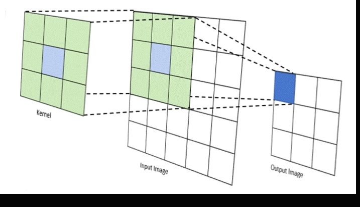

## The Convolution Process

**1. The Kernel Introduction**

Convolution begins with a small grid known as a kernel. This matrix is the secret sauce in the whole process. The kernel contains specific values that dictate how the image will be transformed. Think of it as a set of instructions for our convolution magic.

Convolution starts with a small grid, the kernel. This matrix typically has 3x3 or 5x5 dimensions, containing specific numerical values. Each value in the kernel acts as a weight, determining the contribution of the corresponding pixel to the new transformed value.

**2. Pixel Interaction**

The kernel starts its journey by sliding over the pixels of the image. At each position, the kernel interacts with the pixel values it covers. This interaction involves a bit of math – multiplication and addition – where the values in the kernel and corresponding pixel values team up for a small calculation.

**For example**, if the pixel value is 'a' and the kernel weight is 'b', the contribution at that position is 'a * b'

**3. Summing it Up**

The results of these small calculations are summed up. This sum becomes the new value for the pixel at the center of the kernel's attention. It's like the kernel whispers, "Here's your new value, pixel!"

Mathematically, it's expressed as the sum of (a * b) for each pixel and weight pair in the kernel.

**4. Traversing the Entire Image**

This process repeats for every pixel in the image. The kernel slides and calculates, creating a transformed image as it goes. It's a systematic dance across the entire image, with each pixel taking its turn to be transformed

Mathematically, it's expressed as the sum of (a * b) for each pixel and weight pair in the kernel.

In discrete terms (for digital images), the convolution operation can be expressed as:

where f is the input image, g is the filter, and ( I , j ) represents the position in the output image.

**Examples of Convolution:**

Consider a simple 3x3 image matrix f and a 3x3 filter matrix g. The convolution operation involves sliding the filter over the image, multiplying corresponding elements, and summing the results to obtain the output image.

The convolution operation (f∗g) results in a new image matrix where each pixel is obtained by multiplying and summing the values based on the filter weights.

Understanding the mathematics and role of convolutional kernels provides a foundation for advanced image processing techniques, including those used in convolutional neural networks (CNNs). While the detailed mathematics and manual application of convolution may seem a bit intricate, the good news is you don't need to memorize complete algorithms or perform the entire mathematical process manually. In practical applications, Python scripts and specialized libraries can efficiently handle the convolution process, making it more accessible and user-friendly. This allows individuals to focus on the conceptual understanding of convolution's principles, empowering them to leverage its power without getting bogged down by intricate calculations

**5. The Flipping Act**

Ah, here's the sneaky part. Before anything starts, we flip the kernel both horizontally and vertically. This ensures a true convolution, like looking at the world through a mirror. It might sound like an extra step, but it's the key to making the magic work.

where f is the input image, g is the filter, and ( I , j ) represents the position in the output image.

Before applying this kernel to the image during convolution, we need to flip it both horizontally and vertically. Let's break down the flipping process:

**Original Kernel:**

Horizontally Flipped Kernel:

Vertically Flipped Kernel:

Flipped Both Horizontally and Vertically:

Now, this flipped kernel is ready for the convolution process. During convolution, this flipped kernel will slide over the pixels of the image, performing mathematical operations at each position as explained in the previous steps.

The flipping ensures that the convolution operation is consistent and aligns with the mathematical conventions, allowing the kernel to capture patterns and features in the image accurately.

**6. The Big Picture**

As the kernel finishes its dance across the image, we're left with a completely transformed picture. The values in the kernel, combined with the pixel interactions, have woven a new visual story. This is the essence of convolution – a step-by-step process that turns an ordinary image into something extraordinary.

 
 
 

    

        <a href="whyConvolution.md">&#x2B05; Previous Article</a>
        
<b>Why Convolution</b>

    

    

        <a href="Convolution Example.md">Next Article &#x27A1;</a>
        
<b>whyConvolution</b>

    

